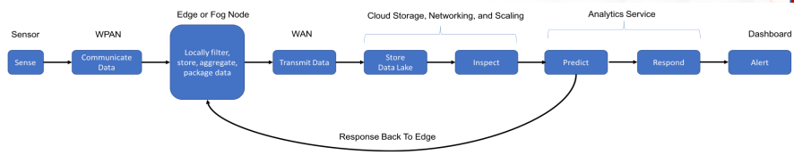
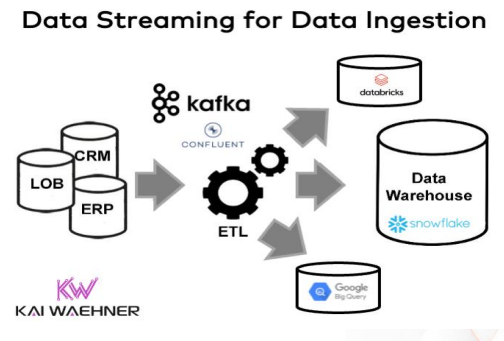

### How big data and IOT are related
- The tools created for big data and analytics are useful for corralling the influx of data streaming in from IOT devices.
- Using IOT's big data we get from the connected devices, we can drive optimization and automation of existing business process and invent new business models, solutions and products.
- Big data and its analytics are crucial for the effective functioning of IOT and is the fuel of IOT and AI that drives the connected things is its brain.
- Big data enables real-time analysis of the data generated by IoT, hence enables IoT developers to optimize these tools to broaden the current perspective and help with improving information processing efficiency.
- Steps:
	+ A group of unstructured data is generate by IoT devices and stored in the big data system.
	+ A big data system is a shared distributed database where a huge amount of data is stored.
	+ Stored data is analyzed using analytic tools like Hadoop MapReduce or Apache Spark.
	+ Generating the reports of analyzed data.

### Cloud pipeline
- In a Top-level cloud pipeline, data will transit through several mediums (WPAN links, broadband, cloud storage in the form of a data lake and so on). When we consider the following architectures to build a cloud analytics solution, we have to consider the effects of scaling.

### Explain how data streaming is done for data ingestion

- Reliable and scalable data ingestion is crucial for any analytics platform, whether you build a data warehouse or data lake.
- data ingestion = data integration
- Data integration with ETL workflows connectes to various source systems and processes incoming events before ingesting them into one or more data sinks.
- A common option is to run ETL workloads in the data warehouse or data lake. A message queue is sufficient for data ingestion, however running ETL workloads in the data ingestion pipeline has several advantages:
- True decoupling between the processing and storage layer enables a scalable and cost-efficient infrastructure. ETL workloads are processed in real-time, no matter what pace each downstream application provides.

### Difference between data warehouse and data lake

|Data Warehouse|Data Lake|
|:------------:|:-------:|
|Process and transform data for advanced querying and analytics in a more structured database environment|Essentially a highly scalable storage repository that holds large volumes of raw data in its native format until required for use.|
|Contains highly structured data that is cleaned, pre-processed and refined. This data is stored for very specific use cases such as BI|Contains unstructured, semi-structured and structured data with minimal processing. It can be used to contain unconventional data such as log and sensor data.|
|Data is processed before ingestion and periodically purged to maintain data cleanliness and health. Hence it contains lesser data than data lakes|Contains vast amounts of data in the order of petabytes. Since the data can be in any form and is minimally pre-processed, large amounts of unstructured data can be stored indefinitely and can be transformed when in use only.|
|Contains historic and relational data, such as transaction systems, operations,etc.|Contains data to be used for ML, Streaming, AI, etc.|

### What are different IOT tools. Explain any one
- IoT tools are a network or connection of devices, vehicles, equipment applying embedded electronics, home appliances, buildings and many more. These tools help the developers to explore and create innovative IOT applications and devices.
- Intel's Edison development platform is an example for IoT tools. It is a low-cost, product-ready, general purpose compute platform. It's a single board computer platform that helps us to build amazing stuff just like the Arduino, using an Intel Atom processor with a dual-core CPU at 500 Mhz and a microcontroller at 100 Mhz. It sports 1 GB of memory, 4 GB of storage and even has WiFi and bluetooth 4.0 capabilities and 40 GPIOs.
- Other tools available are: Raspberry Pi, Tessel2, Arduino, Eclipse IoT, Kinoma, Kaax

### What are different types of sensors
- Temperature sensors: Detects the temperature of the air or a physical object and convert that temperature level into an electrical signal that can be calibrated accurately reflect the measured temperature.
- Pressure sensors: Measures the pressure applied to the sensor and can detect things like atmospheric pressure, pressure of a stored gas / liquid in a sealed system like a tank, etc.
- Motion sensors: Detects the movement of a physical object by using technologies like infrared, microwave detection or ultrasonic.
- Level sensors: Translates the level of a liquid relative to a benchmark normal value into a signal. Eg: Fuel guages display the level of fuel in a vehicle's tank.
- Image sensors: Captures images to be digitally stored for processing. Eg: License plate readers.
- Proximity sensors: Detect presence or absence of objects that approach the sensor through a variety of technologies like inductive, capacitive, photoelectric or ultrasonic.
- Water quality sensors: Measures parameters around water quality like chemical presence, oxygen levels, electrical conductivity, pH levels.
- Chemical sensors: Detects the presence of specific chemical substances which may have inadvertently leaked from their containers into spaces that are occupied by personnel and are useful in controlling industrial process conditions.
- Gas sensors: Chemical sensors tuned to detect the presence of combustible, toxic or flammable gas in the vicinity of the sensor.
- Smoke sensors: Detects presence of smoke conditions.
- Infrared sensors: Detects infrared radiation that is emitted by objects.
- Acceleration sensors: Measures the rate of change of velocity of an object.
- Gyroscopic sensors: Measures the rotation of an object and determine the rate of its movement (angular velocity).
- Humidity sensors: Detects the relative humidity of the air.
- Optical sensors: Responds to light that is reflected off of an object and generate a corresponding electrical signal for use in detecting or measuring a condition.

### Criteria's for selecting the sensors
- Accuracy required: Difference between the measured value and true value should be as low as possible.
- Precision: Ability to reproduce repeatedly with a given accuracy. Should be very high.
- Sensitivity: ratio of change in output to a unit change of the input. Should be chosen to allow sufficient output.
- Operating range: Difference between max and min value of the sensed parameter, sensors should have wide operating range and good accuracy over the range.
- Resolution: Smallest change in the sensor which can differentiate. Sensors should have high resolution.
- Speed respone: Time taken by the sensor to respond should be minimum. respone time should be very less.
- Reliability: Should be high, mean time to failure should be high.
- Maintenance: Should be easy and frequency of maintenance should be less.
- Calibration: Should be easy to calibrate, as sensors need frequent calibrations. Drift should be as min as possible.
- Cost: Sensors should be affordable.
- Linearity: Percentage of deviation from the best-fit linear calibration curve should be less.
- Environmental conditions: Sensors should operate over wide environmental conditions.
- Interfacing: Sensors should be compatible with different instruments for interfacing.
- Size and weight: Sensors should have a small size and weight.
- The nature of output required from the sensor whether the digital or analog has to be considered while selecting a sensor.

### Classification of sensor
- Active and Passive sensors
	+ Active sensors are sensors that require an external power source to operate, eg: Radar
	+ Passive sensors generate their own electric signal and do not require any external power source, eg: Thermal sensors.
- Contact and Non-contact sensors
	+ Contact sensors require physical contact with their stimulus, eg: strain gauge.
	+ Non-contact sensors don't require any physical contact, eg: optical sensors.
- Absolute and relative sensors
	+ Absoulte sensors provides an absolute reading of its stimulus, eg: thermometer.
	+ Relative sensors provide measurement relative to a fixed or variable measurement, eg: thermocouple.
- Analog and Digital sensors
	+ Analog sensors produce continuous analog output signals, proportional to its measurement, eg: Pressure sensors.
	+ Digital sensors convert the data transmission, digitally, eg: Digital accelerometers.
- Miscellaneous sensors
	+ Other types of sensors in the field and they would fall under the miscellaneous category, eg: electric, biological, chemical, radioactive, etc.

### Embedded system
- An embedded system is a realization of a definition of some kind of automatic process guided by a set of rules.
- It is a stand alone system designed to perform a particular task without any human intervention.
- Managed by microcontrollers or digital signal processors (DSP), application-specific integrated circuits (ASIC), field-programmable gate arrays (FPGA), GPU technology and gate arrays. These processing systems are integrated with components dedicated to handling electric and mechanical interfacing.
- The basic structure of an embedded system is:
	+ Sensor: Measures and converts the physical quantity to an electrical signal, which can then be read by an electronic instrument.
	+ A-D converter: Analog to Digital converter converts the analog signal sent by the sensor into a digital signal.
	+ D-A converter: Digital to Analog converter converts the digital data fed by the processor to analog data.
	+ Actuator: Compares the output given by the D-A converter to the actual output stored and stores the approved output.