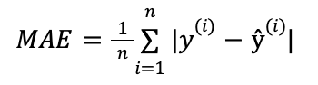

## Explain Support Vector Machine
- Support Vector Machines are a set of supervised learning methods used for classification, regression and outliers detection.
- SVM maps training examples to points in space so as to maximise the width of the gap between the two categories. New examples are then mapped into that same space and predicted to belong to a category based on which side of the gap they fall.
- In addition to performing linear classification, SVMs can efficiently perform a non-linear classification using the kernel trick, implicitly mapping their inputs into high-dimensional feature spaces.
- Basically a simple linear SVM classifier works by making a straight line between two classes, so all of the data points on one side represents a category and the data points on the other side of the line will be put into a different category. So there can be an infinite number of lines to choose from.
- Types of SVM
	+ Simple SVM: Used for linear regression and classification problems
	+ Kernel SVM: Has more flexibility for non-linear data as we can add more features to fir a hyperplane instead of a two-dimensional space.


- Pros
	+ Effective on datasets with multiple features like financial or medical data.
	+ Effective in cases where number of features is greater than the number of data points.
	+ Uses a subset of training points in the decision function called support vectors which makes it memory efficient.
	+ Different kernel functions can be specified for the decision function.
- Cons
	+ If # of features is a lot mroe than the # of data points, avoiding over-fitting when choosing kernel functions and regularization term is crucial.
	+ SVMs don't directly provide probability estimates. Those are calculated using an expensive five fold cross-validation.
	+ Works best on small sample sets because of its high training time.
	
## Explain Neural Networks
> Neural networks reflect the behavior of the human brain, allowing computer programs to recognizze patterns and solve common problems in the fields of AI, machine learning and deep learning.
- It refers to system of neurons, either organic or artificial in nature. It is a series of algorithms that endeavors to recognize underlying relationships in a set of data through a process that mimics the way the human brain operates.


- They rely on training data to learn and improve their accuracy over time.
- Each individual can be thought of as its won regression model, composed of input data, weights, a bias (or threshold), and output.


- Once an input layer is determined, weights are assigned. These weights help determine the importance of any given variable. All inputs are then multiplied by their respective weights and then summed. Them, the output exceeds a given threshold, it activates the node, passing data to the nest layer in the network. This process of passing data from one layer to the next layer defines this neural network as a feedforward network.
- Types of Neural networks
	+ Feedforward Neural Networks: Comprises of an input layer, a hidden layer(s) and an output layer. While these neural networks are also commonly referred to as MLPs, it's important to note that they are actually comprised of sigmoid neurons, not perceptrons. Data usually is fed into these models to train them and they are the foundation for CV, NLP, etc.
	+ Convolutional Neural Networks: Similar to feedforward networks but they're usually utilized for image recognition, pattern recognition and/or computer vision. These networks harness principles from linear algebra, particularly matrix multiplication, to identify patterns within an image.
	+ Recurrent Neural Networks: Identified by their feedback loops. These learning algorithms are primarily leveraged when using time-series data to make predictions.
	
## Explain Keras
- Keras is an API which follows the best practices for reducing cognitive load.
- It offers consistent and simple APIs, minimizing the number of user actions required for common use cases and it provides clear and actionable error messages. It also has extensive documentation and developer guides.
- Written in python, it runs on top of the machine learning platform `Tensorflow`. Developed with a focus on enabling fast experimentation. Being able to go from idea to result as fast as possible is key to doing good research.
- It contains numerous implementations of commonly used neural-network building blocks such as layers, objectives, activation functions, optimizers, etc.
- Also supports convolutional and recurrent neural networks. Other utility layers like dropout, batch normalization and pooling.

## Explain Python Image Library
- The Python Imaging Library adds image processing capabilities to our python interpreter.
- It provides extensive file format support, and efficient internal representation and fairly powerful image processing capabilities.
- The core image library is designed for fast access to data stored in a few basic pixel formats. It should provide a solid foundation for a general image processing tool.
- It has standard procedures for iamge manipulations like:
	+ Image filtering
	+ Image bluring
	+ Image smoothing
	+ Image edge detection
	+ Image enhancing
	+ Image sharpening
	+ Image contring
	+ Adjusting Brightness
	+ Pre-pixel manipulations
	+ Masking and transperancy handling
	+ Adjusting Colour
	+ Adjusting Contrast
- To install PIL we can use the following command: `pip install Pillow`
- How to read an image using PIL
```python
from PIL import Image
img = Image.open('image.ext')
```
- resizing an image
```python
img.resize((16,9))
```
- rotating an image
```python
img.rotate(90)
```
- cropping an image
```python
img.crop((100,100,200,200))
```

## Explain any 2 Image Processing algorithms.
- **Gaussian Blur**
	+ It is also known as Gaussian smoothing.
	+ The effect of this blurring is similar to looking at the image through a transparent screen.
	+ It is the result of blurring the image by the Gaussian function.
	+ Used to reduce the noise and details in the image.
	+ It is best to divide the process into 2 passes using the separable property of Gaussian blur.
	+ In the first pass a 1-D kernel is used to blur the image in only horizontal or vertical direction.In the second pass the same 1-D kernel is used to blur the remaining direction, resulting effect is the same as convolving a 2-D kernel in a single pass.
	+ Syntax: `img.filter(ImageFilter.GaussianBlur)`
- **Fourier transform image processing**
	+ It decomposes the image into its sine and cosine components.
	+ The sinusoid function consists of:
		* _Magnitude_ : Related to contrast
		* _Spatial frequency_ : Related to brightness
		* _Phase_ : Related to colour information
	+ It is used if we want to access the geometric characteristics of a spatial domain image. As the image is decomposed into its sinusoidal components it is easier to examine certain frequencies of the image
- **Wavelet image processing**
	+ Wavelets are a general way to represent and analyze multiresolution images
	+ Useful for	
		* Image compression
		* Noise removal
	+ They are the functons that are concentrated in time and frequency around a certain point.
	+ Fourier transformation deals with frequencies but does not provide temporal details. To overcome the drawbacks of fourier transformation we can use wavelet transformation.
	+ In image processing it is used to divide information present on an image into two discrete components 'approximations' and 'details'.
	+ Image is passed through 2 filters, high pass and low pass. The image is then decomposed into approximations (low frequency components)and details (high frequency components). If the details are insignificant they can be values as zero without significant impact on the image thereby achieving filtering and compression.
- **Harris corner detection**
	+ It basically find the difference in intensity for a displacement of *(u,v)* in all directions.
	+ The window function is either a rectangular window or a Gaussian window which gives weights to pixels underneath.
	+ The equation which determines whether a window can contain a corner or not is R = det(M) - k(trace(M))<sup>2</sup>
		* where:
		* det(M) = λ1λ2
		* trace(M) = λ1 + λ2
		* λ1 and λ2 are the eigenvalues of M
	+ When |R| is small , the region is flat.
	+ When R < 0, the region is an edge.
	+ When R is large, the region is a corner.
	+ syntax: `cv2.cornerharis(img,blockSize,ksize,k)`
- **Morphological image processing**
	+ It is a collection of non-linear operations related to the shape or morphology of features in an image.
	+ It relies only on the relative ordering of pixel values, not on their numerical values and therefore are especially suited to the processing of binary images.
	+ It probes an image with a small shape or template called a structuring element. The structuring element is positioned in all possible locations in the image and it is compared with the corresponding neighbourhood of pixels. The structuring element is a small binary image, i.e a small matrix of pixels each with a value of zero or one.
	+ syntax: `cv2.erode()`, `cv2.dilate()`, `cv2.morphologyEx(img,cv2.MORPH_OPEN,kernel)`, `cv2.morphologyEx(img,cv2.MORPH_CLOSE,kernel)`
	
## Explain OpenCV
- OpenCV (Open Source Computer Vision) library is an open source computer vision and machine learning software library.
- It was built to provide a common infrastructure for CV applications and to accelerate the use of machine perception.
- It has more than 2500 optimized algorithms for computer vision and machine learning. These can be used to detect and recognize faces, identify objects, classify human actions, track camera movements, etc.

## Explain KNN

- The `K-Nearest-Neighbours` is a non-parametric, supervised learning classifier, which uses proximity to make classifications or predictions about the grouping of an individual data point.
- While it can be used for either regression or classification problems, it is typically used as a classification algorithm.
- The neighbors are taken from a set of objects for which the class or the object property value is known. The algorithm is sensitive to the local structure of the data.
- Training phase of the algorithm consists only of storing the feature vectors and class labels of the training samples.
- In classification phase, `k` is a user-defined constant and an unlabeled vector is classified by assigning the label which is most frequent among the `k` training samples nearest to that query point.
- The best value of `k` depends upon the data, generally larger values of `k` reduces effect of the noise on the classification.
- It can be selected by various heuristic techniques. A general rule of thumb is choosing the value of k, k=N<sup>1/2</sup> where N is the total number of samples in our training dataset as a starting point.
- The value of `k` which gives the lowest error is the ideal value for `k`.

## Explain object detection
- Object detection is a computer vision technique for locating instances of objects in images or videos. Object detection algorithms typically leverage machine learning or deep learning to produce meaningful results.
- When humans look at images or video, we can recognize and locate objects of interest within a matter of moments. The goal of object detection is to replicate this intelligence using a computer.
- How it works:
	+ Creating and train a custom object detector. Designing a network architecture to learn the features for the objects of interest, we also need to compile a very large set of labeled data to train the CNN. The results of a custom object detector can be remarkable.
	+ Using a pre-trained object detector: Using deep learning we can leverage transfer learning an approach that enables you to start with a pre-trained network and then fine-tune it for your application. This method can provide faster results because the object detectors have already been trained on thousands or even millions of images.
	+ Machine learning techniques like Aggregate Channel Features (ACF), SVM classification using Histograms of Oriented Gradient features, Viola-Jones algorithm for human face or upper body detection.

## Explain fine tuning
- Fine tuning means making weights of a trained neural network and use it as initialization for a new model being trained on data from the same domain.
- It is used to speed up the training and overcome small dataset size.
- One strategy is training the whole initialized network or 'freezing' some of the pre-trained weights (usually whole layers).
- Steps:
	+ Pretrain a neural network model (source model) on a source dataset.
	+ Create a new neural network model (target model), which copies all model designs and their parameters on the source model except the output layer.
	+ We assume that the model parameters contain the knowledge learned from the source data and this knowledge will also be applicable to the target dataset. We also assume that the output layer of the source model is closely related to the labels of the source dataset, thus it is not used in the target model.
	+ Add an output layer to the target model, whose number of outputs is the number of categories in the target dataset. Then randomly initialize the model parameters of this layer.
	+ Train the target model on the target dataset, such as a chair dataset. The output layer will be trained from scratch, while the parameters of all the other layers are fine-tuned based on the parameters of the source model.
- When target datasets are much smaller than source datasets, fine-tuning helps to improve model's generalization ability.

## Feature extraction
- It refers to the process of transforming raw data into numerical features that can be processed while preserving the information in the original data set. It yields better results than applying machine learning directly to the raw data.
- Manual feature extraction requires indentifying and describing the features that are relevant for a given problem and implementing a way to extract those features.
- Automatred feature extraction uses specialized algorithms or deep networks to extract features automatically from images without need for human intervention. Eg: Wavelet scattering.
- Applications:
	+ Object recognition
	+ Image alignment and stitching
	+ 3D stereo reconstruction
	+ Navigation for robots/self-driving cars
- Traditional features detection techniques:
	+ Harris Corner Detection
	+ Shi-Tomasi corner detector
	+ Binary Robust Independent Elementary Features
- Deep learning feature extraction techniques:
	+ CNN
	+ SuperPoint
	+ D2-Net
	+ LF-Net
	+ Image feature matching

## Edge Detection
- It is an image processing technique for finding the boundaries of objects within images. It works by detecting discontinues in brightness.
- It is used for image segmentation and data extraction in areas such as image processing, computer vision.
- Common edge detection algorithms include Sobel, fuzzy logic, Canny, Prewitt, Roberts, etc.
- Edges extracted from a two-dimensional image of a 3-d scene can be classified as either viewpoint dependent or viewpoint independent.
- A typical edge might for instance be the border between  a block or red colour and a block of yellow. In contrast a line can be a small number of pixels of a different colour on an otherwise unchanging background. For a line, there may therefore usually be one edge on each side of the line.
- Application:
	+ Edge thinning: Removing the unwanted spurious points on the edges in an image.
- Syntax: `img.filter(ImageFilter.FIND_EDGES)`

## Explain Random Forest
- Random forest combines the output of multiple decision trees to reach a single result. Its ease of use and flexibility have fueled its adoption, as it handles both classification and regression problems.
- It utilizes both bagging and feature randomness to create an uncorrelated forest of decision trees.
- While decision trees consider all the possible feature splits, random forests only select a subset of those features.
- Random forest algorithm have three main hyperparameters, which need to be set before training. These include node size, the number of trees and the number of features sampled.
- It is made up of a collection of decision trees and each tree is the ensemble is comprised of a data sample drawn from a training set with replacement, called the bootstrap sample.
- Of that training sample, one-third of it is set aside as test data, known as the out-of-bag sample (oob).
- Another instance of randomness is then injected through feature bagging, adding more diversity to the dataset and reducing the correlation among decision trees.
- For a regression task, the individual decision trees will be averaged and for a classification task a majority vore will yield the predicted class.
- OOB sample is then used for cross-validation, finalizing that prediction.
- Benefits:
	+ Reduced risk of overfitting
	+ Provides flexibility
	+ Easy to determine feature importance
- Challanges:
	+ Time-consuming process
	+ Requires more resources
	+ More complex

## Explain Tensorflow
- Tensorflow is an end-to-end open source platform for machine learning, it has a comprehensive, flexible ecosystem of tools, libraries and community resources that lets researchers push the state-of-the-art in ML and gives developers the ability to easily build and deploy ML-powered applications.
- It provides a collection of workflows with intuitive, high-level APIs like Keras using which we can build and train ML models easily.
- Its flexible architecture allows for easy deployment of computation across a variety of platforms and from desktops to clusters of servers.
- TensorFlow computations are expressed as stateful dataflow graphs.
- These models can be deployed in the cloud, on-permises, browser or on-device.
- Applications at Google:
	+ Search
	+ Translate
	+ Maps
	+ Photos
	+ Speech
	+ Youtube
	
## Explain Tesseract and provide the flow for OCR.
- Tesseract is an open source text recognition (OCR) Engione.
- The package contains an OCR engine - `libresseract` and a command line program `tesseract`.
- It has a neural net based (LSTM) based OCR engine which is focused on line recognition, but also still supports the legacy Tesseract OCR engine.
- It has unicode support and can recognize more than 100 languages. It supports image formats like PNG,  JPEG and TIFF. For output it supports plain text, HTML, PDF, etc.
- We can use it directly via the command line by using an API or use 3rd party GUI tools.
- We can either install Tesseract via pre-built binary package or build it from source.

## Short note on activation functions for neural networks
- Activation function decides, whether a neuron should be activated or not by calculating weighted sum and further adding bias with it.
- The purpose of the activation function is to introduce non-linearity into the output of a neuron.
- Activation functions make the back-propagation possible since the gradients are supplied along with the error to update the weights and biases.
- A neural network without an activation function is essentially just a linear regression model. The activation function does the non-linear transformation to the input making it capable to learn and perform more complex tasks.
- Types:
	+ Sigmoid function: A differentiable real function, defined for real input values and containing positive derivatives everywhere with a specific degree of smoothness. It appears in the output layer of the deep learning models and is used for predicting probability based outputs.
	+ Hyperbolic tangent function: Tanh function, a smoother, zero-centered function having a range between -1 to 1.
	+ Softmax function: Computes probability distribution from a vector of real numbers. It generates an output that ranges between values 0 and 1 and with the sum of probabilities being equal to 1.
	+ Rectified Linear Unit (ReLU) function: A nearly linear function that retains the properties of linear models, which makes them easy to optimize with gradient-descent methods. It performs a threshold operation on each input element where all values less than zero are set to zero.
	+ Exponential Linear Units (ELUs) function: It can eliminate the vanishing gradient problem by using identity for positive values and by improving the learning characteristics of the model and decreases the bias shifts by pushing mean activation towards zero during the training process.
	
## Loss function
- It is the function used to evaluate a candidate solution is referred to as the objective function.
- It compares the target and predicted output values, the hyperparameters are adjusted to minimize the average loss.
- In TensorFlow, the loss function the neural network uses is specified as a parameter in model.compile() `model.compile(loss='mse',optimizer='sgd')` OR
```
low.keras.losses import mean_squared_error
model.compiile(loss=mean_squared_error, optimizer='sgd')
```
- Types:
	+ Regression loss function: Ex. MSE, MAE, MAPE
	+ Classification loss function: Ex. Binary Cross-Entropy, Categorical Cross-Entropy.
	
- Mean Squared Error(MSE): finds the average of the squared differences between the target and the predicted outputs


- Mean Absolute Error: Finds the average of the absolute differences between the target and the predicted outputs.


- Binary Cross-Entropy: Used in binary classification models. It determines the loss between the actual and predicted values, it needs to compare the actual value 0 or 1 with the probability that the input aligns with the category.
- Categorical Cross-Entropy loss: When number of classes is greater than two, we must use categorical cross-entropy.


## Image normalization
- It is the process in image processing that changes the range of pixel intensity values.
- Normalization helps get data within a range and reduces the skewness, it also tackles the diminishing and exploding gradients problems.
- To normalize the pixel values between 0 and 1: `img /= 255.0`
- In keras `layer = tf.keras.layers.Normalization()`. The layer will shift and scale inputs into a distribution centered around 0 with standard deviation to 1. Calls `(input - mean) / sqrt(var)` at runtime.