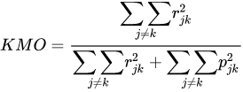
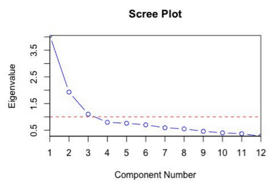

# Factor Analysis
> It is a technique used to reduce a large number of variables into fewer number of factors. It models observed variables and their covariance structure in terms of smaller number of underlying unobservable latent factors, these factors are concepts that may describe an observed phenomenon. Factor is a set of observed variables that have similar response patterns, they are associated with a hidden variable (called a confounding variable) that isn't directly measured.

**Fields where factor analysis is involved include physiology, health, intelligence, sociology, ecology, etc.**

_Suppose we are conducting a survey and we want to know whether the items in the survey have similar patterns of responses, do these items 'hang together' to create a construct? **The basic assumption of factor analysis is that for a collection of observed variables there are a set of underlying variables called factors, that can explain the interrelationships among those variables**._

### What is a factor
> A factor is a latent variable which describes the association among the number of observed variables. Every factor explains a certain variance in observed variables.
- The maximum number of factors are equal to a number of observed variables.
- Factors are also known as latent variables, hidden variables, unobserved variables or hypothetical variables.
### What is Factor Analysis
- Factor analysis is an exploratory data analysis method used to search influential underlying factors or latent variables from a set of observed variables. It helps in data interpretations by reducing the number of variables.

### Advantages of factor analysis
- Both objective and subjective attributes can be used.
- It can be used to identify the hidden dimensions or constraints which may or may not be apparent from direct analysis.
- It is not extremely difficult to do and at the same time its inexpensive and gives accurate results.
- There is flexibility in naming and using dimensions.
### Disadvantages of factor analysis
- The usefulness depends on the researcher's ability to develop a complete and accurate set of product attributes. If important attributes are missed the value of procedure is reduced accordingly.
- Naming of the factors can be difficult multiple attributes can be highly correlated with no apparent reasons.
- If the observed variables are completely unrelated the factor analysis is unable to produce meaningful pattern.
- It is not possible to know factors actually represents, only theory can help inform the researcher's on this.

### Applications of Factor Analysis
- Market research
- Advertising
- Psychology
- Finance and operation research

### How does Factor analysis work
1. Factor extraction
- The # of factors and approach for extraction selected using variance partitioning methods such as PCA and common factor analysis.
2. Factor rotation
- Rotation tries to convert factors into uncorrelated factors. The main goal here is to improve the overall interpretability. There are lots of rotation methods like varimax, quartimax, promax, etc.
- 
### Types of factor analysis
1. Exploratory factor analysis
> Its basic assumption is that any observed variable is directly associated with any factor.
- When we don't have any idea about what structure the data is or how many dimensions are in a set of variables.
- It is used to find the underlying structure of a large set of variables. It reduces data to a much smaller set of summary variables.
- EFA allows all items to load on all factors, while with CFA we must specify which factors to load.
2. Confirmatory factor analysis
> Its basic assumption is that each factor is associated with a particular set of observed variables. CFA confirms what is expected on the basic.
- Used for verification as long as we have a specific idea about the structure of our data or how many dimesions are in a set of variables.
- CFA can answer questions like "Does my 10 question survey accurately measure one specific factor?"
- Implemeting:
1. Perform a literature review to help choose an appropriate model.
2. Determinse if unique values are possible for the population parameter estimation.
3. Collect the data
4. Perform initial data analysis to check for issues like missing data, collinearity or outliers.
5. Estimate the population parameters.
6. Determine if the model of choice is working. If unacceptable, consider performing Exploratory Factor Analysis.

### Types of factoring
1. Principal component analysis
2. Common factor analysis
- Extracting the common variance and put them into factors.
3. Image factoring
- Based on correlation matrix, OLS regression is used to predict the factors.
4. Maximum likelihood method

### Factor loading
>The factor loading is a matrix which shows the relationship of each variable to the underlying factor. It shows the variance explained by the observed variables.
- The correlation coefficient for the variable and factor. Factor loading shows the variance explained by the variable on that particular factor. In SEM 0.7 or higher factor loading represents that the factor extracts sufficient variance from that variable.

### Factor score
- The factor score is also called the component score. This score is of all row and columns, which can be used as an index of all variables and can be used for further analysis. We can standardize this score by multiplying a common term. With this factor score, whatever analysis we will do, we will assume that all variables will behave as factor scores and will move.
- Methods
1. Regression method: Scores produced have a mean of 0 and a variance equal to the squared multiple correlation between the estimated factor scores and the true factor values. The scores may be correlated even when factors are otrthogonal.
2. Bartlett scores: The scores that are produced have a mean of 0. The sum of squares of the unique factors over the range of variables is minimized.
3. Anderson-Rubin method: A method of estimating factor score coefficients, a modification of the Bartlett method which ensures orthogonality of the estimated factors. The scores that are produced have a mean of 0, have a standardd deviation of 1, and are uncorrelated.

### What is factor rotation
- Rotation is a tool for better interpretation of factor analysis. Rotation can be orthogonal or oblique. It redistributed the commonalities with a clear pattern of loadings.

### Rotation method
There are different tyes of rotation methods
1. Varimax rotation method
- Orthogonal rotation method that minimizes the number of variables that have high loadings on each factor. This method simplifies the interpretation of the factors.
2. Quartimax rotation method
- A rotation method that minimizes the number of factors needed to explain each variable. This method simplifies the interpretation of the observed variables.
3. Direct oblimin rotation method
- Method for oblique (nonorthogonal) rotation. When delta equals 0 (the default) solutions are most oblique. As delta becomes more negative, the factors become less oblique. To override the default delta of 0, enter a number less than or equal to 0.8
4. Promax rotation method
- An oblique rotation, which allows factors to be correlated. This rotation can be calculated more quickly than a direct oblimin rotation, so it is useful for large datasets.
5. Equamax rotation method
- A rotation method that is a combination of the varimax method, which simplifies the variables. The number of variables that load highly on a factor and the number of factors needed to explain a variable are minimized.

### What are commonalities?
- Commonalities are the sum of the squared loadings for each variable. It represents the common variance. It ranges from 0 to 1 and value close to 1 represents more variance.

### KMO
- Kaiser-Meyer-Olkin measure of sampling adequacy tests whether the partial correlations among variables are small.
- It is a measure of how suited your data is for Factor Analysis.
- The statistic is a measure of the proportion of variance among variables that might be common variance. The lower the proportion, the more suited your data is for factor analysis.

KMO returns values between 0 and 1. A rule of thumb for interpreting it is:
<ul style='list-style-type:square;'>
<li>KMO between 0.8 and 1 indicate the sampling is adequate.</li>
<li>KMO less than 0.6 or 0.5 is not adequate and that remedial action should be taken.</li>
<li>KMO values close to zero means that there are large partial correlations comparted to the sum of correlations.</li>
</ul>

|Range|Result|
|:---:|:----:|
|0 to 0.49|Unacceptable|
|0.5 to 0.59|Miserable|
|0.6 to 0.69|Mediocre|
|0.7 to 0.79|Middling|
|0.8 to 0.89|Meritorious|
|0.9 to 1|Marvellous|

The formula for KMO test is:

Where:
- R = [rij] is the correlation matrix
- U = [uij] is the partial covariance matrix

### Bartlett's test of sphericity
- It tests whether the correlation matrix is an identity matrix, which would indicate that the factor model is inappropriate.
> An identity correlation matrix means the variables are unrelated and not ideal for factor analysis.
- It checks if there is a redundancy between variables that can be summarized with some factors.
- The null hypothesis of the test is that the variables are orthogonal i.e not correlated, alternative hypothesis being they are correlated enough to where the correlation matrix diverges significantly from the identity matrix. If the p-value from Bartlett’s test of sphericity is lower than our chosen significance level then our dataset is suitable for a data reduction technique.

### Assumptions
- No outlier: SSCP type associations are sensitive of outliers.
- Adequate sample size: The case must be greater than the factor
- No perfect multicollinearity: Factor analysis model assumes that all items each possesses unique factor and those factors are orthogonal.
- Linearity: Linear factor analysis is performed based on a SSCP-type association matrix, despite the magnitude of a covariance coefficient reflects more than just linearity, it is linear in nature even when covariances are used. Variables are linear combinations of factors, hence linearity is implied in the resulting associations.
- Interval data: The elements are either continuous measures or are conceptualised as continuous while measured on discrete quantitative scale. Linear factor analysis assumes that latent common and unique factors are continuous.
- Distribution: Linear FA does not require normality of the input data. Moderately skewed distributions are acceptable. Normality is assumed for unique factors in the model(they act as regressional errors), but not for the common factors and the input data.

### What are latent variables
- A latent or hidden variable is generally thought of as a variable that is not directly measurable or observable.

### What is eigenvalues
- Eigenvalues represent variance explained each factor from the total variance. It is also known as characteristic roots.

### Scree plot
- It is the visual representation of factor's eigenvalues. This plot helps us to determine the number of factors where the curve makes an elbow.

### Factor Analysis VS Principal Component Analysis
|Factor Analysis|Principal Component Analysis|
|:-------------:|:--------------------------:|
|Explains the covariance in data.|Explains the maximum amount of variance.|
|Does not require factors to be orthogonal.|PCA components are fully orthogonal to each other.|
|Observed variables are linear combinations of the unobserved variable/factor.|PCA component is a linear combination of the observed variable.|
|Underlying factors are labelable and interpretable.|PCA components are uninterpretable.|
|It is the latent variable method.|It is a dimensionality reduction method.|
|It is a modelling technique.|PCA is observational.|

