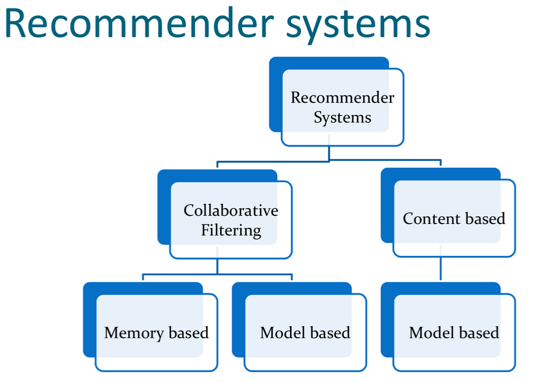
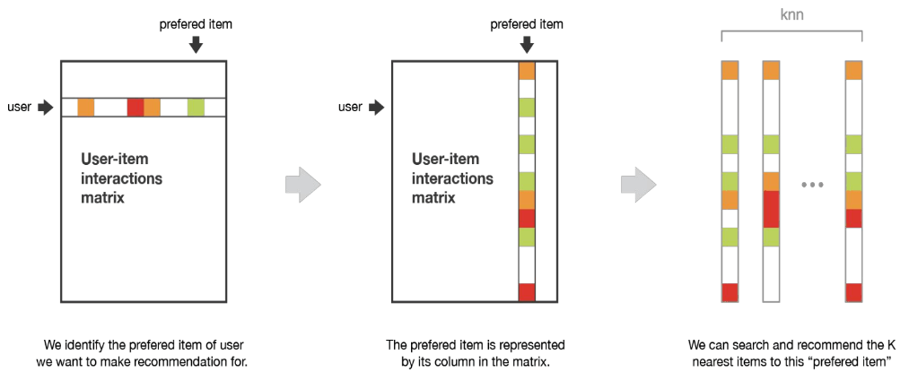
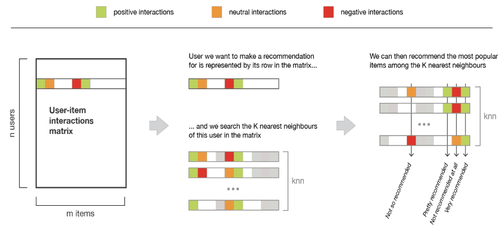
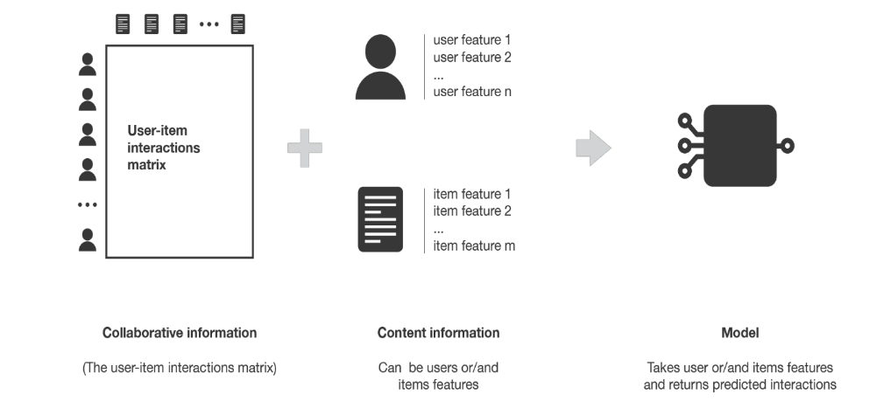

# Recommender systems
>A recommender system is a process that seeks to predict user preferences adn recommend things to the user based on many different factors.
- Recommender systems are the systems that are designed to recommend things to the user based on many different factors. These systems predict the most likely product that the users are most likely to purchase and are of interest to.
- These systems predict the most likely product that the users are most likely to purchase and are of interest to. Companies like netflix, amazon, etc use recommender systems to help their users to identify the correct product or movies for them.
- The recommender system deals with a large volume of information present by filtering the most important information based on the data provided by a user and other factors that take care of the user's preference and interest.

|Company|Application of recommender system|
|:-----:|:-------------------------------:|
|Facebook|People you may know|
|Netflix|Movies you may enjoy|
|Amazon|Products you might want to buy / Customers who bought this also bought|
|Youtube|Recommended videos / Videos similar to other videos you watch|
|LinkedIn|Jobs you maybe interested in|

## Collaborative filtering
>Based on gathering and analyzing data on user's behavior. This inclused the user's online activities and predicting what they like based on the similarity with other users.
- Collaborative methods for recommender systems are methods that are based solely on the past interactions recorded between users and items in order to produce new recommendations. These interactions are stored in 'user-item interactions matrix'.
	- Netflix and Youtube: Subscribers = users, movies/videos = items.
	- Amazon and flipkart: Customers = Users, Products = items.
* No model
	- Users and items are represented directly by their past interactions (large sparse vectors). Recommendations are done following nearest neighbours information.
* Model
	- New representations of users and items are build based on a model (small dense vectors). Recommendations are done following the model information.

### User Interaction Matrix
|Subscriber ID|Item 1|Item 2|Item 3|Item 4|
|:-----------:|:----:|:----:|:----:|:----:|
|Subscriber 1|Hunger games|Martian|MIB|Jurassic Park|
|Subscriber 2|MI|GOT|MI2|Rambo|
|Subscriber 3|Interstellar|Inception|MIB|Martian|
|Subscriber 4|Hunger games|MIB|Interstellar|Rambo|
|Subscriber 5|GOT|Breaking bad|Friends|Narcos|
|Subscriber 6|Narcos|MI|GOT|MIB|
|Subscriber 7|TBBT|Friends|HIMYM|Narcos|
|Subscriber 8|Inception|MIB|Jurassic Park|Hunger games|

## Item-Item method
- To make a new recommendation to a user, the idea of item-item method is to find items similar to the ones the user already "positively" interacted with.
- Two items are considered to be similar with both of them did it in a similar way.
- This method is said to be item-centred as it represent items based on interactions users had with them and evaluate distances between those items.
- Assume that we want to make a recommendation for a given user. First, we consider the user liked the most and represent it by its vector of interaction with every users.
- We can compute similarities between the best item and all the other items.
- Once the similarities have been computed, we can then keep the KNN to the selected best item that are new to our user of interest and recommend these items. In order to get more relevant recommendations, we can do this job for more than only the user's favourite item and consider the `n` preferred items instead. In this case, we can recommend items that are close to several of these preferred items.

## User-User method
- Tries to identify users with the most similar "interactions profile" (nearest neighbours) in order to suggest items that are the most popular among these neighbours (and that are new to our user). This method is said to be user-centred as it represent users based on their interactions with items and evaluate distances between users.
- When computing similarity between users, the number of common interactions `how much items have already been considered by both users?` should be considered carefully. Most of the time we want to avoid a user that only have one interaction in common with our reference user could have a 100% match and be considered as being closer than someone having 100 common interactions and agreeing only 98% of them.
- So we have to consider that two users are similar if they have interacted with a lot of common items in the same way.
- Pros: Widely applicable as only needs user-item interactions, easy to understand and implement.
- Cons: Cold start problem, limitations for scale.

## User-User vs Item-Item methods

|User-User|Item-Item|
|:-------:|:-------:|
|Among all users, we keep the ones that are the closest to our user.|Among items the user interacted with, we keep the ones he preferred|
|We recommend the items that are the preferred of the user neighbours|We recommend items that are the closest to the user preferred items|

## Content based
>This approach filters the items based on the likings of the user and gives results based on what the user has reated earlier.
- Content-based recommender system tries to guess the features or behavior of a user given the item's features, they reacts positively to.
- Content-based filtering does not require other user's data during recommendations to one user.
- Vector Space Model (VSM) is used to model this approach.
- The similarity of the item from its description and introduces the concept of TF_IDF (Term Frequency-Inverse Document Frequency).
- Advantages:
	+ The model doesn't need any data about other users, since the recommendations are specific to this user. This makes it easier to scale to a large number of users.
	+ The model can capture the specific interests of  a user, and can recommend niche items that very few other users are interested in.
- Disadvantages:
	+ Since the features representation of the items are hand-engineered to some extent, this technique requires a lot of domain knowledge. Therefore, the model can only be as good as the hand-engineered features.
	+ The model can only make recommendations based on existing interests of the user. In other words, the model has limited ability to expand on the user's existing interests.

>Content based methods suffer far less from the cold start problem than collaborative approaches: new users or items can be described by their characteristics (content) and so relevant suggestions can be done for these new entities. Only new users or items with previously unseen features will logically suffer from this drawback, but once the system old enough, this has few to no chance to happen.