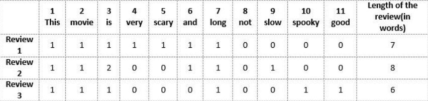
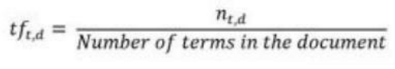
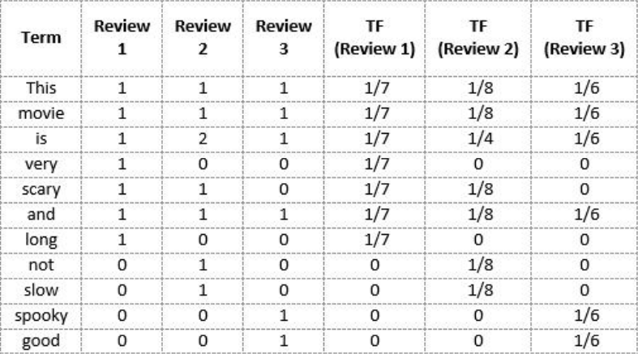
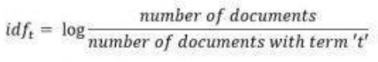
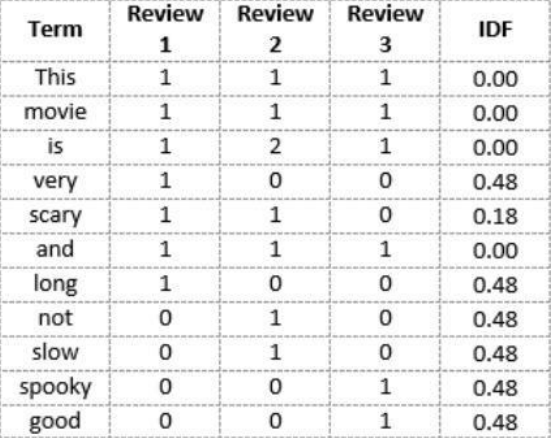
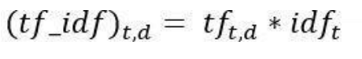
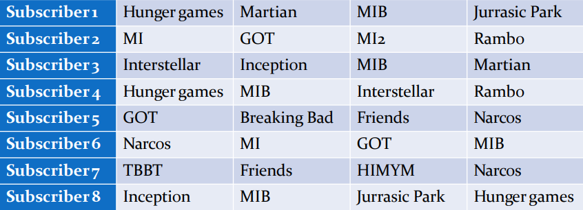
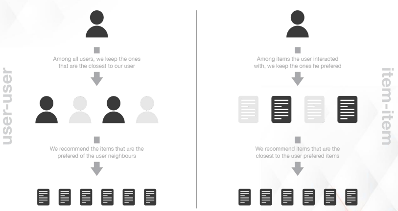
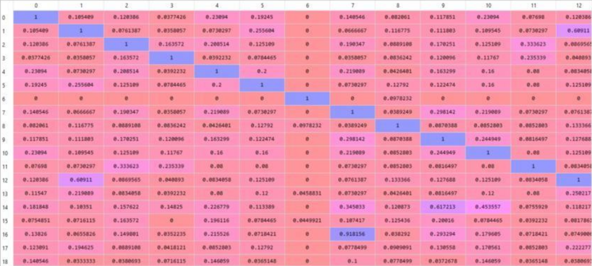

### Text mining
- Text mining is the process of transformng unstructured text into structured data for each analysis.
- It uses NLP, allowing machines to understand the human language, process it and extract valuable insights from unstructured text.
- A text mining algorithm could help us identify the most popular topics that arise in customer comments and the way that people feel about our company / products.
- Applications of text mining:
	+ Classification: Also known as text categorization is the process of categorizing text into organized groups. Used for spam filtering and sentiment analysis.
	- Summarization: Generating a concise and meaningful summary of text from multiple text resources such as articles, books, etc.
	- Clustering: Automatically grouping textual documents into clusters based on their content similaity.
	- Information retrieval: Finding material of an unstructured nature that satisfies an information need from within a large collection.
	- Information extraction: Automatically extracting structured information from unstructured and/or semi-structured machine readable documents.
	- Speech recognition: Also known as Automatic Speech Recognition (ASR), is the capability which enables a program to process human speech into a written format, eg: Google Assistant, Bixby, etc.
	- chat bots: Google assistant, Bixby, etc.

### Text processing
- It refers to the automation of analyzing electronic text. It allows machine learning models to get structured information about the text, to be used for analysis, manipulation or generate new text.
- Text data can show a business how their customers search, buy and interact with their brand, products and competitors online. Eg: Topic analysis, Sentiment analysis, Intent detection, Language classification.
- Ways of generating text:
	+ Surverys and reviews:
		* Customer surveys, product reviews.
	+ Support tickets
- Steps:
	+ Data processing
		* Tokenization (convert sentences to words)
			- Removing unnecessary punctuations, tags.
			- Removing stop words (frequent words like `the`, `is`, etc)
		+ Stemming (words are reduced to a root by removing inflection through dropping unnecessary characters, usually a suffix)
		+ Lemmatization - Removes inflections by determining the part of speech and utilizing detailed database of the language.
	+ Feature extraction
		* Breaking down the text into a numerical format that's easily readable by the machine (converting text sentences into numeric vectors), this is known as word embedding.
	+ Choosing an ML algorithm
		* Approaches like 'Naive Bayes' or 'Support Vector Machines' for spam filtering are widely used.
- Applications
	+ Machine translation
	+ Information retrieval
	+ Sentiment analysis
	+ Information extraction
	+ Question answering
	
### Word Embedding
> The process of converting text into numeric vectors is called word embedding
- Bag of Words (BoW)
	+ A bag-of-words is a representation of text that describes the occurence of words within a document.
	+ Disadvantages are if newer sentences contain new words then our vocabulary size would increase and thereby the length of the vectors would increase to, the vectors would also contain many zeros, thereby resulting in a sparse matrix. We retain no information on the grammer of the sentences nor on the ordering of the words in the text.
	
```
Review 1: This movie is very scary and long
Review 2: This movie is not scary and is slow
```


- TF-IDF
	+ Term Frequency-Inverse Document Frequency is a numerical statistic that is intended to reflect how important a word is to a document in a collection or corpus.
	+ Term frequency is a measure of how frequently a term `t` appears in a document `d`.
	

	
	- the numerator `n` is the number of times the term `t` appears in the document `d`.
	


	- IDF is a measure of how important a term is.



```
Review 1: This movie is very scary and long
Review 2: This movie is not scary and is slow
Review 3: This movie is spooky and good
```


	
	- TF-IDF
	


review2: This movie is not scary and is slow

|Term|TF|IDF|TF-IDF|
|:--:|--|:-:|:----:|
|This|1/8|0|0|
|Movie|1/8|0|0|
|is|1/4|0|0|
|not|1/8|0.48|0.06|
|scary|1/8|0.18|0.0225|
|and|1/8|0|0|
|slow|1/8|0.48|0.06|

- Word2Vec
- CBoW
- Skip gram
- Glove

### Word cloud
- Also known as tag cloud, it represents the frequency or the importance of each word.

### Recommender systems
- Recommender systems are the systems that are designed to recommend things to the user based on many different factors. These systems predict the most likely product that the users might purchase and are of interest to.
- The recommender system deals with a large volume of information present by filtering the most important information based on the data provided by a user and other factors that take care of the user's preference and interest.

### Collaborative filtering
- Based solely on the past interactions recorded between users and items in order to produce new recommendations. The interactions are stored in 'user-item interactions matrix'
- `Netflix/Youtube Users=Subscribers, Items=Movies`
- User-Item Interaction matrix



- Pros:
	+ Widely applicable as only needs user-item interactions.
	+ Easy to understand and implement.
- Cons:
	+ Cold start problem.
	+ Limitations for scale.
### Item-Item method
- We find items similar to the ones the user already 'positively' interacted with.
- Two items are considered to be similar if most of the users that have interacted with both of them did it in a similar way.
- Known to be 'item-centred' as it represent items based on interactions users had with them and evaluate distances between those items.
- First we consider the item user A liked the most and represent it by its vector interaction with every users. Then we compute similarities between the 'best-item' and all the other items. Then we keep the `k-nearest-neighbours` to the selected best item that are new to our user of interest and recommend these items.

### User-User method
- Roughly tries to identify users with the most similar 'interactions profile' in order to suggest items that are the most popular among these neighbours (and that are 'new' to our user).
- Known to be 'user-centred' as it represent users based on their interactions with items and evaluate distances between users.
- First users are represented by its vector of interactions with the different items ('its line' in the interaction matrix). Then we compute some kind of similarity between our user of interest and every other users, its such that 2 users with similar interactions on the same items should be considered as being close. We keep the `k-nearest-neighbours` to our user and then suggest the most popular items among them.

### Difference between User-User and Item-Item


### Content based recommender system
- Tries to guess the features or behavior of a user given the item's features, he/she reacts positively to. It does not require other user's data during recommendations to one user.
- Filters the items based on the likings of the user. it gives result based on what the user has rated earlier. The method to model this approach is the Vector Space Model (VSM). It derives the similarity of item from its description and introduces the concept of TF-IDF.
- Advantages:
	+ Model doesn't need any data about other users, since the recommendations are specific to this user. This makes it easier to scale to a large number of users.
	+ Model can capture the specific interests of a user and can recommend niche items that very few other users are interested in.
- Disadvantages:
	+ Requires a lot of domain knowledge since the feature representation of the items are hand-engineered.
	+ Model can only make recommendations based on existing interests of the user.

### Advantages of content-based filtering over collaborative filtering
- Content based methods suffer far less from the cold start problem than collaborative approaches as new users or items can be described by their characteristics and so relevant suggestions can be done for these new entities.
- Only new users or items with previously unseen features will logically suffer from this drawback, but once the system's old enough, this has few to no chance to happen.

### Matrix factorization
- It is a simple embedding model. Given a feedback matrix A <math xmlns="http://www.w3.org/1998/Math/MathML">
  <mo>&#x2208;<!-- ∈ --></mo>
  <msup>
    <mi>R</mi>
    <mrow class="MJX-TeXAtom-ORD">
      <mi>m</mi>
      <mo>&#x00D7;<!-- × --></mo>
      <mi>n</mi>
    </mrow>
  </msup>
</math>, where _m_ is the number of users (or queries) and _n_ is the number of items, the model learns:
- A user embedding matrix U <math xmlns="http://www.w3.org/1998/Math/MathML">
  <mi>U</mi>
  <mo>&#x2208;<!-- ∈ --></mo>
  <msup>
    <mrow class="MJX-TeXAtom-ORD">
      <mi mathvariant="double-struck">R</mi>
    </mrow>
    <mrow class="MJX-TeXAtom-ORD">
      <mi>m</mi>
      <mo>&#x00D7;<!-- × --></mo>
      <mi>d</mi>
    </mrow>
  </msup>
</math>, where row i is the embedding for user i.
- An item embedding matrix V <math xmlns="http://www.w3.org/1998/Math/MathML">
  <mi>V</mi>
  <mo>&#x2208;<!-- ∈ --></mo>
  <msup>
    <mrow class="MJX-TeXAtom-ORD">
      <mi mathvariant="double-struck">R</mi>
    </mrow>
    <mrow class="MJX-TeXAtom-ORD">
      <mi>n</mi>
      <mo>&#x00D7;<!-- × --></mo>
      <mi>d</mi>
    </mrow>
  </msup>
</math>, where row j is the embedding for item j.
- The embeddings are learned such that the product UV<sup>T</sup> is a good approximation of the feedback matrix A.
- The _(i,j)_ entry of U.V<sup>T</sup> is simply the dot product [U<sub>i</sub>,V<sub>i</sub>] of the embeddings of user `i` and item `j`, which we want to be close to A<sub>i,j</sub>.

### Cosine similarity
- It is a metrix used to measure how similar two items are.
- It measures the cosine of the angle between two vectors projected in a multi-dimensional space. Output ranges from `0-1`, where 0 means no similarity and 1 means both the items are 100% similar.
 Python's sklearn package has a `cosine_similarity()`, `cosine_sim = cosine_similarity(count_matrix)`.
- The `cosine_sim` matrix is a numpy array with calculated cosine similarity between each movies.


### Dimensionality reduction
> Transforming data from a high-dimenstion space into a low-dimensional space so that the new data retains some meaningful properties of the original data
- It is the process of reducing the number of random variables under consideration, by obtaining a set of principal variables.
	+ Feature elimination
	+ Feature extraction
		* Principal Component Analysis
			- An unsupervised learning algorithm which transforms a large set of variables into a smaller one that still contains most of the information in the large set.
			- PCA is the process of computing the principal components and using them to perform a change of basis on the data, sometimes using only the first few principal components. Principal components of a collection of points in a real coordinate space are a sequence of `p unit vectors`, where the `i-th` vector is the direction of  a line that best fits the data while being orthogonal to the first `i-1` vectors, the best fitting line is defined as one that minimizes the average squared perpendicular distance from the points to the line.
			- Steps:
				+ Standardization
				+ Computing covariance matrix
				+ Calculating eigenvector and eigenvalue
				+ Compute principal components
				+ Reduce data dimension
			- Advantages:
				+ Lack of redundancy as due to orthogonal components.
				+ Components are independent of each other.
				+ Improves performance of ML model as it eliminates correlated variables.
				+ Helps with overfitting issues.
				+ Results in high variance.
				+ Reduction of noise since the max variation basis is chosen hence, small variations are ignored automatically.
			- Disadvantages:
				+ Difficult to evaluate the covariance in a proper way.
				+ Data needs to be standardized before implementing PCA else it becomes difficult to identify optimal principal components.
				+ It may skip a bit of information in comparison to the actual list of features.
				+ Transforms actual features that are linear combinations of actual features, hence are difficult to read or interpret.
