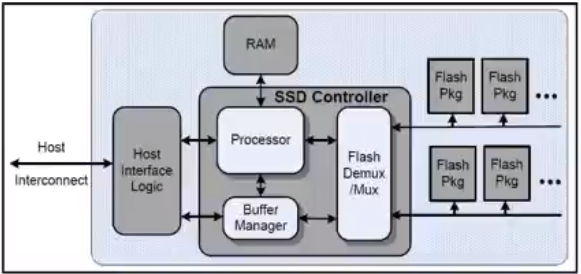
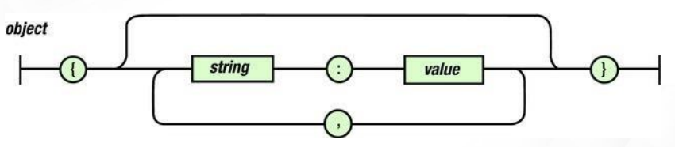
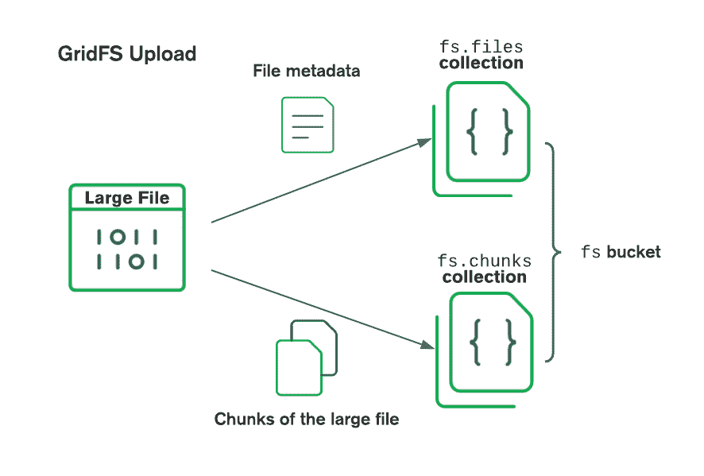

1. Cap theorem
> A distributed system can deliver only two of three desired characteristics: Consistency, Availability and Partition Tolerance.
- Consistency: All clients should see the same data at the same time, no matter which node they connect to. Whenever data is written to one node, it must be instantly forwarded or replicated to all the other nodes, it must be instantly forwared or replicated to all other nodes in the system before the write is deemed successful.
- Availability: Any client making a request for data gets a response, even if one or more nodes are down. All working nodes in the distributed system must return a valid response for any request, without exception.
- Partition tolerance: A partition is a communications break within a distributed system. Partition tolerance means that the cluster must continue to work despite any number of communication breakdowns between nodes in the system.
- NoSQL databases are classified based on 2 CAP characteristics:
	+ CP databases: Delivers consistency and partition tolerance at the expense of availability. When a a partition occurs between any 2 nodes, the system shuts down the non-consistent node until the partition is resolved.
	+ AP databases: Delivers availability and partition tolerance at the expense of consistency. When a partition occurs, all nodes remain available but might return an older version of data than others.
	+ CA databases: Delivers consistency and availability across all nodes, but can't do this if there's a partition between any 2 nodes in the system, however and therefore can't deliver fault tolerance.
	
2. SSD
- SSD stands for Solid State Disk.
- It uses integrated circuit assemblies to store data persistently, typically using flash memory and functioning as secondary storage.
- It enables improved database I/O performance and also allows increased capacity and economy of server memory.
- Unlike HDDs SSDs don't have moving parts, hence being more robust adn consuming less power.
- However they are more expensive compared to magnetic disks and write/modify operations are not as fast as READ operations.
- Aerospike, a NoSQL database attempts to provide a database architecture that can fully exploit the IO characteristics of a flash SSD.


3. Explain JSON
- JSON stands for Java Script Object Notation, a subset of the javascript language.
- It is a lightweight data-interchange format.
- JSON is built on two structures:
	+ A collection of name/value pairs. In various languages, this is realized as an object, record, struct, dictionary, hash table, keyed list or associative array.
	+ An ordered list of values.
- JSON values

|Data types|
|:--------:|
|string|
|number|
|object|
|array|
|true|
|false|
|null|

- JSON structural character tokens

|Token|Literal|
|:---:|:-----:|
|Array opening|[|
|Array closing|]|
|Object opening|{|
|Object closing|}|
|Name/Value seperator|:|

- JSON parsing is the process of analyzing a string of symbols, either in natural language or in computer languages according to the rules of a formal grammar.
- JSON stringify is used for serializing javascript values into that of a valid JSON.


- Features of JSON
	+ JSON is scalable, language independent and lightweight.
	+ Easy to read and write, text based and human-readable data exchange format.

4. Indexes in MongoDB
- Indexes are essential tools the database administrator can use to consciously aid the database engine and improve its performance.
- Indexes are special data structures that store only a small subset of the data held in a collection's documents seprately from the documents themselves.
- Without indexes, MongoDB must perform a collection scan to select appropriate documents.
- MongoDB creates a unique index on the `_id` field during the creation of a collection.
- Types of index:
	+ Single field: MongoDB supports the creation of user-defined ascending/descending indexes on a single field of a document in addition to the `_id` index.
	+ Compound index: User-defined indexes on multiple fields. The order of fields in a compound index has significance, eg: index consists of `{columnA:1, columnB:-1}` then the index sorts first by columnA and then within each `columnA` value sorts by `columnB`.
	+ Multikey index: Used to index content stored in arrays. When a field that holds an array value in indexed, MongoDB creates seperate index entries for every element of the array.
	+ Geospatial index: Two special indexes: `2d indexes` that uses planar geometry when returning results and `2dsphere indexes` that use spherical geometry to return results.
	+ Hashed indexes: Indexes the hash of the value of a field.
- Index properties:-
	+ Unique indexes: MongoDB rejects duplicate values for the indexed field.
	+ Partial indexes: Only index the documents in a collection that meet a specified filter expression.
	+ Sparse indexes: Ensures that the index only contain entries for documents that have the indexed field.
	+ TTL indexes: Automatically remove documents from a collection after a certain amount of time.
- Some limitations are:-
	+ A single collection can have no more than 64 indexes.
	+ There can be no more than 32 fields in a compund index.
	+ Queries can't use both text and geospatial indexes.

7. CRUD operations
- Create operations
	- Create a database: `use database_name`
	- Creating documents:
```mongodb
db.monuments.insertOne(
  {
    "name": "The Pyramids of Giza",
    "city": "Giza",
    "country": "Egypt",
    "gps": {
      "lat": 29.976480,
      "lng": 31.131302
    }
  }
)
OR
db.monuments.insertMany([
  {"name": "The Valley of the Kings", "city": "Luxor", "country": "Egypt", "gps": { "lat": 25.746424, "lng": 32.605309 }},
  {"name": "Arc de Triomphe", "city": "Paris", "country": "France", "gps": { "lat": 48.873756, "lng": 2.294946 }},
  {"name": "The Eiffel Tower", "city": "Paris", "country": "France", "gps": { "lat": 48.858093, "lng": 2.294694 }},
  {"name": "Acropolis", "city": "Athens", "country": "Greece", "gps": { "lat": 37.970833, "lng": 23.726110 }},
  {"name": "The Great Wall of China", "city": "Huairou", "country": "China", "gps": { "lat": 40.431908, "lng": 116.570374 }},
  {"name": "The Statue of Liberty", "city": "New York", "country": "USA", "gps": { "lat": 40.689247, "lng": -74.044502 }}
])
```
- Reading operations
	- Reading documents: 
```
db.monuments.find()
OR
db.monuments.find().pretty()
```

	+ Reading with conditions:
	`db.monuments.find({'country':'France'}).pretty()`
	

- Updating documents: `db.monuments.updateOne(
  { "name": "Arc de Triomphe" },
  {
    $set: { "name": "Arc de Triomphe de l'Étoile" }
  }
)`

OR
`db.monuments.updateMany(
  { },
  {
    $set: { "editor": "Sammy" }
  }
)`

- Deleting Documents: `db.monuments.deleteOne(
    { "name": "Arc de Triomphe de l'Étoile" }
)`

OR

`db.monuments.deleteMany(
  { "editor": "Sammy" }
)`

8. Journaling in MongoDB
- A journaling file system keeps track of changes not yet committed to the file system's main part by recording the goal of such changes in a data structure known as a journal, which is usually a circular log.
- To provide durability in the event of a failure, MongoDB uses write ahead logging to on-disk journal files.
- WiredTiger uses checkpoints to provide a consistent view of data on disk and allow MongoDB to recover from the last checkpoint.
- Recovery process:
	+ Looks in the data files to find the identifier of the last checkpoint.
	+ Searches in the journal files for the record that matches the identifier of the last checkpoint.
	+ Apply the operations in the journal files since the last checkpoint.
- WiredTiger creates one journal record for each client initiated write operation. The journal record includes any internal write operations caused by the initial write. It creates a single journal record that includes both the update operation and its associated index modifications.
- It uses in-memory buffering for storing the journal records. It syncs the buffered journal records to disk upon any of the following conditions:
	+ If a write operation inclused or implies a write concern.
	+ At every 100 milliseconds
	+ When WiredTiger creates a new journal file. Because MongoDB uses a journal file size limit of 100MB, WiredTiger creates a new journal file approximately every 100 MB of data.
	
9. GridFS
- GridFS is a versatile storage system that is suited to handling large files, such as those exceeding the 16MB BSON document.
- Instead of storing a file in a single document, GridFS divides the file into parts or chunks and stores each chunk as a seperate document. By default, it uses a default chunk size of 255 kB.
- It uses two collections to store files. One collection stores the file chunks and the other stores file metadata.
- We can use GridFWS when we have to access information from portions of large files without having to load whole files into memory, our file system limits the number of files in a directory or we want to keep our files and metadata automatically synced and deployed across a number of systems and facilities.
- We should not use GridFS if we need to update the content of the entire file atomically.


10. Storage engine
- Storage engine in a database is responsible for managing how data is stored, both in memory and on disk.
- In mongodb WiredTiger is the default storage engine, also supports in-memory storage engine.
- WiredTiger provides a document-level concurrency model, checkpointing and compression among other features.
- For most read and write operations, WiredTiger uses optimistic concurrency control. It uses only intent locks at the global, database and collection levels. When storage engine detects conflicts between two operations, one will incur a write conflict causing MongoDB to transparently retry that operation.
- WiredTiger uses MultiVersion Concurrency Control (MVCC), it provides a point-in-time snapshot of the data to the operation. It writes all the data in a snapshot to disk in a consistent way across all data files. WiredTiger creates checkpoints at intervals of 60 seconds, the new checkpoint becomes accessible and permanent when WiredTiger's metadata table is atomically updated to reference the new checkpoint.
- WiredTiger uses a write-ahead log in combination with checkpoints to ensure data durability.
- WiredTiger uses block compression with the snappy compression library for all collections and prefix compression for all indexes.
- MongoDB uses both WiredTiger internal cache and the filesystem cache. The default WiredTiger internal cache size is the larger of either: 50% of ram or 256 MB.

12. Capped collections
- Capped collections are fixed-size collections that support high-throughput operations that insert and retreive documents based on insertion order.
- Once a collection fills its allocated space, it makes room for new documents by overwriting the oldest documents in the collection.
- Capped collections guarantee preservation of the insertion order, queries do not need an index to return documents in insertion order. Without this indexing overhead, capped collections can support higher insertion throughput.
- Use cases for crapped collections:
	+ Store log information generated by high-volume systems. Inserting documents in a capped collection without an index is close to the speed of writing log information directly to a file system.
	+ Cache small amounts of data in a capped collections. Since caches are read rather than write heavy, you would either need to ensure that this collection always remains in the working set or accept some write penalty for the required index or indexes.
- Syntax to create a capped collection

```
db.createCollection( "log", { capped: true, size: 100000 } )
```

13. Distinguish between NoSQL and SQL

|NoSQL|SQL|
|:---:|:-:|
|Document: JSON documents, Key-value: key-value pairs, Columnar tables: tables with rows and dynamic columns, Graph: nodes and edges|Tables with fixed rows and columns|
|Document: general purpose, key-value: large amount of data with simple lookup queries, columnar: large amount of data with predictable query patterns, graph: analyzing and traversing relationships|General purpose|
|Has a rigid schema|Has flexible schema|
|Supports vertical scaling |Supports horizontal scaling|
|Supports ACID transactions|Most do not support multi-record ACID transactions|
|Supports joins|Doesn't require joins|
|Requires ORM|Most do not require ORM|
|Eg: Oracle, MySQL, PostgreSQL|Eg: MongoDB, DynamoDB, HBase, Neo4j|

14. Distinguish between ACID and BASE properties

|ACID|BASE|
|:--:|:--:|
|Simple|Complex|
|High maintenance|Low maintenance|
|Stronger consistency|weaker consistency than ACID|
|Vertical scaling|Horizontal scaling|
|Easier to implement|Difficult to implement|
|Less time required for completion|Requires more time for completion|
|Eg: Oracle, MySQL|Eg:DynamoDB, Cassandra|

15. Limitations of SQL
- Cost: Some versions are costly and hence, programmers cannot access it.
- Complex Interface: Can have a difficult interface that makes few users uncomfortable while dealing with the database.
- Partial Control: Complete control is not given to the database due to hidden business rules.
- Large queries may throw `ParsingException`, when queries consume too much memory.
- Single CPU
- Object-relational mapping layer can be complex.
- Can be difficult to store high-variability data in tables.
- Sharding over many servers can be don but requires application code and will be operationally inefficient.
- Slower development as entity-relationship modeling must be completed
16. Limitations of NoSQL
- ACID transactions can be done only within a document at the database level.
- Databases has its own proprietart nonstandard query language, which prohibits portability.
- Document stores don't provide fine-grained security at the element level.
- No standardization
- Lack of cross-platform support

17. Advantages of SQL
- Faster query processing
- No coding needed as standard SQL makes it very easy to manage the database.
- SQL code is portable to other SQL databases.
18. Advantages of NoSQL
- Availability of drag-and-drop tools.
- Modular architecture allows components to be exchanged.
- Supports vertical and horizontal scaling
- No need for an object-relational mapping layer.
- Easy to store high-variability data.

19. What is big data?
- Big data is data that contains greater variety, arriving in increasing volumes and with more velocity.
- Big data is larger, more complex and so voluminous that traditional data processing software just can't manage them.
- Four Vs of big data:
	+ Volume: Data is collected from a variety of sources, low-density, unstructured data.
	+ Velocity: Data streams into businesses at an unprecendented speed and must be handled in a timely manner.
	+ Variety: Different types of formats data can come in. Structured like numeric data, unstructured data like videos, audio, etc and semi-structured data like CSV, JSON files.
	+ Veracity: Refers to the quality of data. We need to connect and correlate relationships, hierarchies and multiple data linkages.
- Characteristics of big data:
	+ Volatility: Big data is in continuous change.
	+ Veracity: accuracy of the data.
	+ Value: Useful information we can retrieve from the data.
	+ Velocity: The rate at which data is generated
	+ Variety: Different types of data.
	+ Volume: Huge amount of data that is collected and generated.
- Steps in big data analytics:
	+ Ingestion: Data is gathered as well as processed.
	+ Storage: Data is stored mainly in data warehouse or data lake.
	+ Analysis: The big data is processed to abstract valuable insights.
	+ Consumption: Insights are shared with non-technical audiences in the form of visualization.
- Challenges:
	+ Growth issues: Storing all these huge sets of data properly is a huge issue. A lot of the data is unstructured.
	+ Securing data: Securing these huge data sets is important to protect it from malicious hackers.
	+ Integrating data from various sources: Combining all types of data to prepare reports is a challenging task.
	+ Sharing and accessing data: Inaccessibility of data sets from external sources is a frequent challenge. Due to huge volumes of data sharing isn't easy.

22. Significance of `_id`
- `_id` is the primary key on documents in a collection, with it documents can be differentiated from each one another.
- `_id` is automatically indexed.
- By default the `_id` field is of type ObjectID. Users can also override `_id` to something other than an ObjectID.

23. Features of MongoDB
- Ad-hoc queries for optimized, real-time analytics: Ad-hoc query is a short-lived command whose value depends on a variable. MongoDB supports field queries, range queries and regular expression searches.
- Indexing appropriately for better query executions: MongoDB offers a broad range of indices and features with language-specific sort orders that support complex access patterns to datasets. MongoDB indices can be created on demand to accomodate real-time and application requiremens. They can also be declared on any field within any of your documents, including those nested within arrays.
- Replication for better data availability and stability: Replication helps in achieving fault tolerance, by deploying multiple servers for disaster recovery and backup. Horizontal scaling across multiple servers helps with load balancing, data availability and stability.
- Sharding: It is the process of splitting larger datasets across multiple distributed collections, which helps the database distribute and better execute what might otherwise be problematic.
- Authentication: A critical security feature in MongoDB. It ensures that only authorized users can access the database.
- Database triggers: It allows the execution of code when certain events occur in our database.
- Time series data: Time series collections in MongoDB are designed to be storage-efficient and perform well with sequences of measurements.