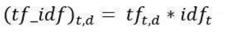

### Structured vs Unstructured data

|Structured|Unstructured|
|:--------:|:----------:|
|Structured data stands for information that is highly organized, factual and to the point|Unstructured data doesn't have any predefined structure to it and comes in all its diversity of forms|
|Quantitative|Qualitative|
|Data warehouses, RDBMS|Data lakes, Non-relational databases|
|Based on relational database|Based on character and binary data|
|Less flexible and schema dependent|Absence of schema, more flexible|
|Harder to scale|more scalable|
|Very robust|less robust|

### Text pre-processing
- Involves transforming text into a clean and consistent format that can then be fed into a model for further analysis and learning.

### Text processing
- It refers to the automation of analyzing electronic text.
- It allows machine learning models to get structured information about the text, to be used for analysis, manipulation or generate new text.
- Steps:
	+ Data processing
		* Tokenization: Used to split paragraphs and sentences into smaller units that can be more easily assigned meaning. Sentence tokenization is used to convert paragraphs to list of sentences, Word tokenization is used to convert sentences to list of words.
		* Stemming: Words are reduced to a root by removing inflection through dropping unnecessary characters, usually a suffix)
		* Lemmatization: Removes inflections by determining the part of speech and utilizing detailed database of the language.
	+ Feature extraction
		* Breaking down the text into a numerical format that's easily readable by the machine (converting text sentences into numeric vectors), this is known as word embedding.
	+ Choosing an ML algorithm
		* Approaches like 'Naive Bayes' or 'Support Vector Machines' for spam filtering are widely used.
		
### Different types of stemmers
- Stemming is a processing technique that lowers inflection in words to their root forms, hence aiding in preprocessing of text, words and documents for normalization.
> inflection is the process through which a word is modified to communicate many grammatical categories.
- Types:
	+ Porter Stemmer
		* Five steps of word reduction are used here, each has its own set of mapping rules. Based on the idea that the suffixes in English are made up of a combination of smaller and simpler suffixes.
		* `from nltk.stem import PorterStemmer`
	+ Snowball Stemmer
		* Is more precise and is referred to as English Stemmer. Based on a programming language called Snowball that processes small strings and is the most widely used stemmer.
		* `from nltk.stem import SnowballStemmer`
	+ Lancaster Stemmer
		* Often produces results with excessive stemming. Over-stemming renders stems non-linguistic or meaningless. Saves the rules externally and basically uses an iterative algorithm.
		* `from nltk.stem import LancasterStemmer`
	+ Regexp Stemmer
		* Identifies morphological affixes using regular expressions. Substrings matching the regular expressions will be discarded.
		* `from nltk.stem import RegexpStemmer`
		
### Difference between Lemmatization and Stemming

|lemmatization|Stemming|
|:-----------:|:------:|
|Considers the context and converts the word into its meaningful base form, which is called lemma.|Removes (Stems) last few characters from a word|
|Uses vocaulary and morphological analysis or words, normally aiming to remove inflections endings only to return the lemma|Refers to a crude heuristic process that chops off the ends of words in hope of achieving this goal, but often includes removal of derivational affixes.|
|Computationally expensive since it involves look-up tables as well|Used in case of large dataset, where performance is an issue|

### Linguistic study in NLP / Steps in evolution of Text processing
- Pragmatics
	+ This branch of NLP focuses at a higher level and process text as whole document
	+ Example: Topic modelling, Summarization, Q&A.
- Semantics
	+ Semantics focuses on understanding the context in the sentence.
	+ Example: Named Entity Recognition (NER), Relationship extraction
- Syntax/Parsing
	+ Here the focus is on the relationship of the words within a sentence
	+ Syntactical analysis is usually done at a sentence-level, where as for morphology the analysis is done at word level.
- Morphology
	+ Morphology is the field of linguistics focused on the study of the forms and formation of the words in a language.
	
### POS-tagging
- POS tagging refers to the automatic assignment of a tag to words in a given sentence.
- It converts a sentence into a list of words with their tags.
- Since this task involves considering the sentence structure, it cannot be done at the Lexical level.
- Example: "I like to read book" is represented as [(I,Preposition),(like,Verb),(read,Verb),(books,Noun)]
- Penn TreeBank Tag Set is most used for the English language. Example:

|Part of Speech|Tag|
|:------------:|:-:|
|Noun (Singular)|NN|
|Noun (Plural)|NNS|
|Verb|VB|
|Determiner|DT|
|Adjective|JJ|
|Adverb|RB|

- Difficulties
	+ Suffers from ambiguity
	+ Example: In the sentence 'book the flight' and 'i like to read books', book acts as a verb or noun.
- Types
	+ Rule based
		- Involves using a dictionary consisting of all the possible POS tags for a given word.
		- If any of the words have more than one tag, hand-written rules are used to assign the correct tag based on the tags of surrounding words.
	- Stochastic tagger
	- A supervised model, involves using with frequencies or probabilities of the tags in the given training corpus to assign a tag to a new world. These taggers entirely rely on statistics of the tag occurrence.

### Process of Lemmatization
- Lemmatization removes inflections by determining the part of speech and utilizing detailed database of the language.
- It groups different inflected forms of words into the root form, having the same meaning.
- It clearly identifies the base form of troubled to trouble denoting same meaning, whereas stemming will cut ed part and convert it to troubl.
- Two methods
	+ Rule based: Uses a bunch of rules that tell how a word should be modified to extract its lemma. Eg: if the word is a verb and terminated with -ing, do some substitutions.
	+ Corpus based: Uses a tagged corpus to provide the lemma for each word. Basically a huge list of words and their related lemma for each PoS.

### Word embedding
- It is the process of converting text into numeric vectors is called word embedding.
- It gives the ability of computers to understand text-based content in a better way.
- Words and documents are represented in the form on numeric vectors allowing similar words to have similar vector representations.
- Extracted features are fed into a ML model so as to work with the text data and preserve the semantic and syntactic information.
- BoW - Bag of Words
	+ A bag-of-words is a representation of text that describes the occurrence of words within a document.
	+ A disadvantage is if newer sentences contain new words then our vocabulary size would increase and thereby the length of the vectors would increase to, the vectors would also contain many zeros thereby resulting in a sparse matrix. We retain no information on grammer of the ordering of the words.
- TF-IDF
	+ Term Frequency-Inverse Document Frequency is a numerical statistic that is intended to reflect how important a word is to a document in a collecton or corpus.
	+ Term frequency is a measure of how frequently a term t appears in a document d.
	+ 
	+ IDF is a measure of how important a term is
	+ 
	+ TF-IDF
	+ 
- Word2Vec
- CBoW
- Skip gram
- Glove
- Importance
	+ If we use encoding instead of word embedding, we have the following issues: similarity issue(word 'cat' is as similar to 'tiger'), vocabulary size issue(feature vector size is the same as the size of the vocabulary, hence it can be a huge sparse vector with just a single 1), computational issue(Many ML models won't work well with very high dimensional and sparse features.)
	
### Difference between document-term matrix and term-document matrix

|document-term matrix|term-document matrix|
|:------------------:|:------------------:|
|Rows correspond to documents in the corpus and columns correspond to terms.|Represents documents vectors in matrix form where rows correspond to the terms in the document, columns correspond to the documents in the corpus and cells correspond to the weights of the terms.|

### Text similarity
- To calculate how two words/documents are close to each other. That closeness may be lexical or in meaning.
- Types:
	+ Lexical similarity
		* Aims to identify how similar documents are on a word level.
		* It provides a measure of the similarity of two texts based on the intersection of word sets of same or different languages.
		* A lexical similarity of 1 suggests that there is complete overlap between the vocabularies.
		* Jaccard Similarity: It measures the similarity between two sets of data to see which members are shared and distinct
		* 
		* Example: - Sent1 = "AI is our friend and it has been friendly" | Sent2 = "AI and humans have always been friendly"
		* 
		* Cosine similarirty: Calculates similarity by measuring the cosine of angle between two vectors.
		* 
	+ Semantic similarity
		* Attempts to compare two texts and decide whether thay are similar in meaning.
		* The idea of distance between items is based on the likeliness of their meaning or semantic content as opposed to lexicographical similarity.
		* Path Length based similarity
			- A simple way to measure the semantic similarity between two synsets is to treat taxonomy as an undirected graph and measure the distance between them in wordnet.
			- The shorter the path from one node to another, the more similar they are. The path length is measured in nodes/vertices rather than links/edges.
			- 
		* Wu-Palmer
			- Calculates relatedness by considering the depths of the two synsets in the WordNet taxonomies, along with the depth of the LCS (Least Common Subsmer).
			- Sub-sumer: A shared parent of two synsets, LCS: The most specific sub-sumer of the two-synsets.
			- 
			
### WordNet
- It is a lexical database of semantic relations between words in more than 200 languages.
- It links words into semantic relations includin synonyms, hyponyms and meronyms.
- Its unique semantic network helps us find word relations, synonyms, grammars, etc.
- Nouns, adjectives, verbs and adverbs are grouped into sets of cognitive synonyms called 'synsets'. Synsets are interlinked using conceptual-semantic and lexical relations such as hyponymy and antonymy.
- Synsets
	+ Synset instances are the groupings of synonymous words that express the same concept.
	+ Each group of synonyms is a synset and a synonym that forms a part of a synset is a lexical variant of the same concept.
	+ A synset maybe defined with a 3-part name of the following form:
		* synset = `WORD.POS.NN`
		* WORD: the word
		* POS: Part of Speech
		* NN: A sense key, a word can have multiple meanings of definition. Therefore, 'cake.n.03' is the third noun sense of the word 'cake'.
- Hyponymy describes the relationship between a generic term and instances of the specified generic term.
	- Hypernyms: More abstract terms. A general term
	- Hyponyms: More specific terms. The instances of the general term.
	- Eg: colour is a hypernym; red,green,yellow, etc are hyponyms.
	
### Word cloud, Why is it important in NLP
- It is a cloud filled with lots of words in different sizes, which represent the frequency or the importance of each word.
- Word cloud is also known as tag cloud, it represents the frequency or the importance of each word.
```
from WordCloud import WordCloud
txt = df.reviews[0]
wordcloud = WordCloud().generate(txt)
plt.imshow(wordcloud,interpolation='bilinear')
plt.axis('off')
plt.show()
```
- They are a powerful way to visualise what our audience really thinks about a topic.
- It reveals the essentials. Delights and provides emotional connection. They're fast and engaging as poring over text to develop themes from research takes time and it may stimulate more questions, which often is a good entry point to discussion.

### Applications of Text Classification
Applications of Text classification
- Detecting urgent issues
	- A fast emergency response system can be made by classifying panic conversation on social media.
	- Authorities can monitor and classify emergency situation to make a quick response if any such situation arises.
	- With the help of text classification, businesses can make sense of large amounts of data techniques like aspect-based sentiment analysis to understand what people are talking about.
	- Example, Customer's about to churn, complaints about a bug issue, downtime
- Tagging content
	- Products can be tagged using categories as a way to improve browsing or to identify related content.
Platforms such as e-commerce, news agencies, blogs, etc can use automated technologies to classify and tag content / products.
- Spam filtering
	- Using previously categorized spam mails to identify patterns, helps detect spam that rule-based approach may not detect.
- Sentiment Analysis
	- Using previously tagged data to train, models can decipher the overall sentiment of data (posts, reviews, etc.) and predict final sentiment.
	- It helps us to understand whether the social perception is positive, negative or neutral towards a product or features.
	- Sentiment analysis on competitor's social post can be used to obtain a benchmark.
- Automating CRM and Customer Support processes.
	- The CRM tasks can directly be assigned and analyzed based on importance and relevance. It reduces manual work and thus is high time efficient.
	- Text classification can be used for automating ticket routing and traiging. It allows you to automatically route support tickets to a teammate with specific product experties, if a customer writes asking about refunds, it can automatically assign the ticket to a teammate with permission to perform refunds.
	- It can also automatically detect the urgency of a support ticket and prioritize them.
	- It can help lower customer churn.

### Gibbs Sampling
- Gibbs sampling is a Markov chain Monte Carlo, which simulates a high-dimensional distribution by sampling on a lower-dimensional subset of variables where each subset is conditioned on the value of all others.
- It has two assumptions:
	- Each article is as monochromatic as possible
	- Each word is as monochromatic as possible
- Gibbs sampling makes it easy to evaluate the conditional distribution.
- Gibbs sampling considers each word token in turn and estimates the probability of assigning the current word token to each topic, conditioned on the topic assignment to all other word tokens.
- From this conditional distribution, a topic is sampled and stored as the new topic assignment for this word token.
