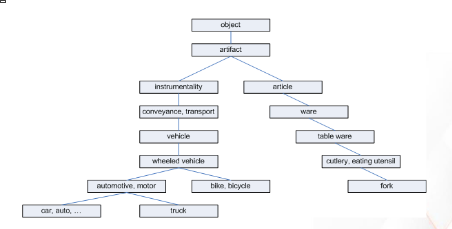
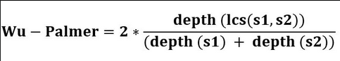

#### Lexical Similarity
- Aims to identify how similar documents are on a word level.
- It provides a measure of the similarity of two texts based on the intersection of the word sets of same or different languages.
- A lexical similarity of 1 suggests that there is complete overlap between the vocabularies.

##### Jaccard Similarity
- It measures the similarity between two sets of data to see which members are shared and distinct.

- Example:
    - Sent1 = "AI is our friend and it has been friendly"
    - Sent2 = "AI and humans have always been friendly"
    - 

##### Cosine similarity
- Calculates similarity by measuring the cosine of angle between two vectors.
- 

#### What is wordnet
- It is a lexical database of semantic relations between words in more than 200 languages.
- It links words into semantic relations including synonyms, hyponyms and meronyms.
- Its unique semantic network helps us find word relations, synonyms, grammars, etc.
- Nouns, verbs, adjectives and adverbs are grouped into sets of cognitive synonyms called 'synsets'. Synsets are interlinked using conceptual-semantic and lexical relations such as hyponymy and antonymy.

#### Synsets
- Synset instances are the groupings of synonymous words that express the same concept.
- Each group of synonyms is a synset, and a synonym that forms a part of a synset is a lexical variant of the same concept.
- A synset maybe defined with a 3-part name of the following form:
    - synset = `WORD.POS.NN`
    - WORD: The word
    - POS: Part Of Speech.
    - NN: A sense key, a word can have multiple meanings or definitions. Therefore, "cake.n.03" is the third noun sense of the word "cake".

#### Hypernyms and Hyponyms
- Hypernyms: More abstract terms
- Hyponyms: More specific terms
- 

#### Semantic Similarity
- Path Length based similarity
    - A simple way to measure the semantic similarity between two synsets is to treat taxonomy as an undirected graph and measure the distance between them in WordNet.
    - The shorter the path from one node to another, the more similar they are. The path length is measured in nodes/vertices rather than in links/edges.
    - 
- Wu-Palmer
	- Calculates relatedness by considering the depths of the two synsets in the WordNet taxonomies, along with the depth of the LCS (Least Common Subsumer).
	- Sub-sumer: A shared parent of two synsets.
	- LCS: The most specific sub-sumer of the two synsets.
	- 